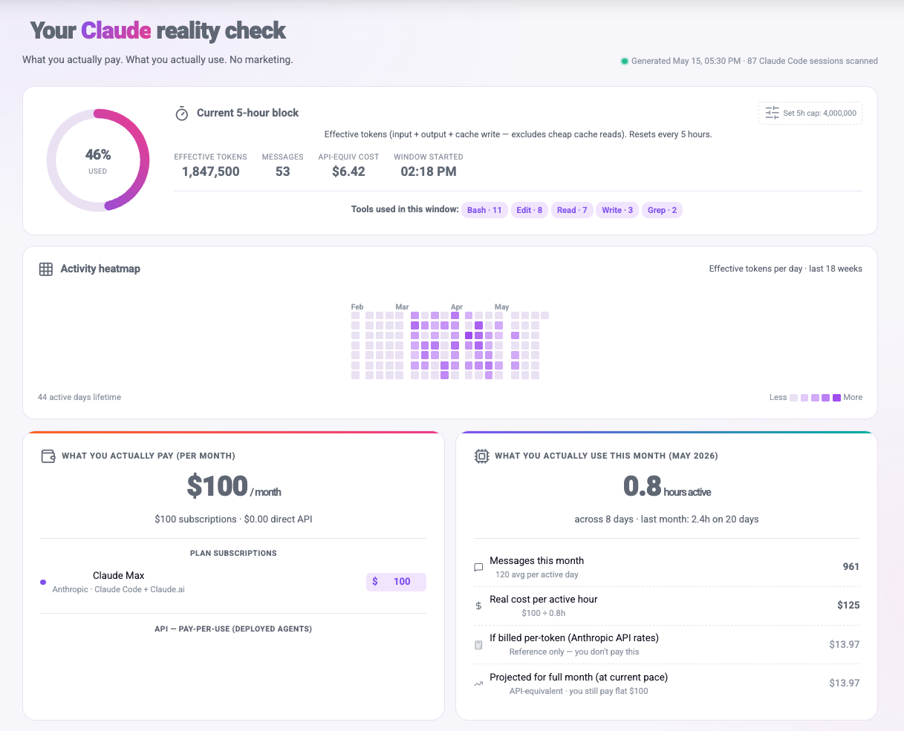
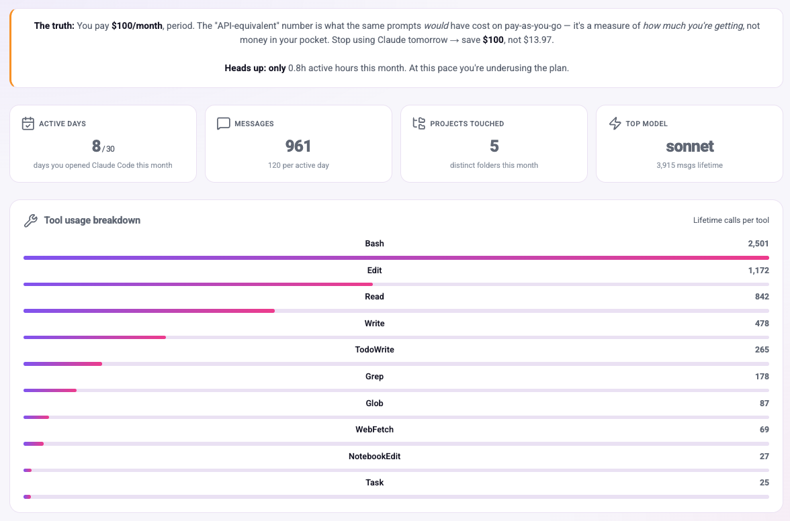
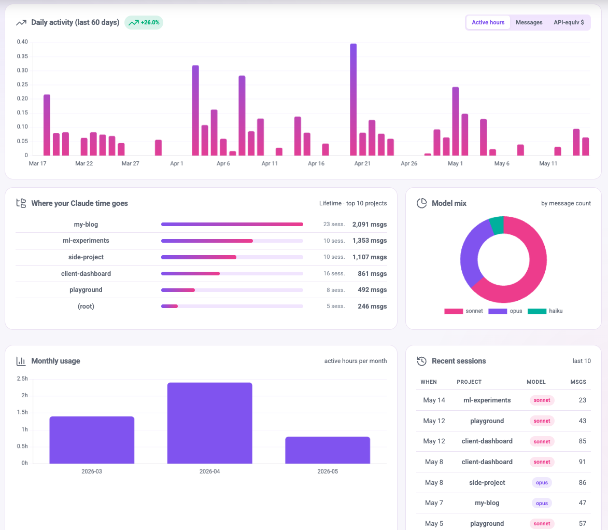

# Claude Usage Dashboard

A **local, no-API, no-account** dashboard for your [Claude Code](https://claude.com/claude-code) usage. Reads the JSON logs Claude Code already writes to `~/.claude` and turns them into a clear, beautiful view of what you actually pay vs. what you actually use.

Single HTML file. One Python script. Opens with double-click. Works offline.



## Why another one?

There are other Claude usage viewers out there. They all answer the same question: *how many tokens did I burn this week*. None of them answer the question I actually care about: **am I getting my money's worth?**

This one starts there. The top of the page is two cards side by side:
- **What you actually pay** — your real subscriptions + any pay-per-use APIs you list, with prices you edit inline. Real cash out.
- **What you actually use** — hours active, messages, projects touched. Plus the *API-equivalent* (what this usage would cost on pay-as-you-go), clearly labeled as a reference, not a savings claim.

Everything else flows from that framing.

## Features

- **5-hour block ring** — effective tokens used in the current rate-limit window, with a settable personal cap
- **Activity heatmap** — 18 weeks × 7 days, GitHub-style intensity grid colored by effective tokens
- **Pay vs Use** — your subscriptions on one side, your real usage on the other, no marketing spin
- **Reality-check banner** — plain English on what your spend actually means
- **Tool usage breakdown** — which tools (Bash, Read, Edit, MCP servers…) you call most, lifetime
- **Daily activity** — last 60 days with a hours / messages / API-equiv $ toggle and a week-over-week delta chip
- **Model mix** — token share across Opus / Sonnet / Haiku
- **Monthly trend** — active hours per month
- **Top projects** — bar list, where your Claude time goes
- **Recent sessions** — last 10
- **Editable subscriptions + API connections** — prices live in localStorage on your machine only
- **i18n** — full English + Hebrew with RTL layout
- **Dark / light theme** — auto-detected from your OS, toggleable
- **Live auto-refresh** — polls the data file every 30 seconds; pause when the tab is hidden
- **Pure static** — one HTML file, no build step, no npm

> **Token accounting:** "effective tokens" = `input + output + cache_write`. Cheap cache reads are excluded because they don't count toward rate limits.





## Try it without your own data

Want to see the dashboard before running anything against your `~/.claude`?

```bash
cp examples/demo-data.json claude-usage-data.json
open index.html
```

You'll see ~70 days of synthetic activity across five example projects. See `examples/README.md` for details.

## Quick start

You need Python 3 (any version since 3.8). That's it.

```bash
git clone https://github.com/Yarin-ops/claude-usage-dashboard.git
cd claude-usage-dashboard

# Generate the data file from your local Claude Code logs.
python3 analyzer.py

# Open the dashboard.
open index.html      # macOS
xdg-open index.html  # Linux
start index.html     # Windows
```

The dashboard reads `claude-usage-data.json` next to it. Both `analyzer.py` and `index.html` are standalone — no server, no build, no install.

### Live mode

If you want the dashboard to update in real time as you use Claude Code:

```bash
python3 analyzer.py --watch
# or with a custom interval (seconds, min 5):
python3 analyzer.py --watch --interval=15
```

Leave that running in a terminal. The dashboard polls the JSON every 30 seconds and re-renders only when `generated_at` changes. A small green dot pulses next to "Generated" to confirm the loop is live.

## Configuring

### Your subscriptions

Open `index.html` and find the `SUBSCRIPTIONS` array near the top of the `<script>` block. Edit the rows to match what you actually pay each month:

```js
const SUBSCRIPTIONS = [
  { id: 'claude-max', name_en: 'Claude Max', name_he: 'Claude Max',
    vendor: 'Anthropic', usd: 100, color: '#8b5cf6',
    what_en: 'Claude Code + Claude.ai', what_he: 'Claude Code + Claude.ai' },
];
```

You can also edit the price inline in the dashboard — click any `$XX` value next to a subscription and type a new amount. It saves to `localStorage` on your machine only.

### Pay-per-use API connections

If you also pay Anthropic / OpenAI / others directly (e.g., for a deployed agent), list them in the `API_CONNECTIONS` array. Prices start blank; click `—` next to one to enter the real amount from the vendor's billing page. The `billing_url` you set on each row becomes a "check billing" link inside the dashboard.

### Personal 5-hour cap

Click the **Set 5h cap** button next to the 5-hour timer. Pick a preset (1M / 2M / 4M / 8M / 16M effective tokens) or enter your own. The progress ring fills based on this cap. Saved to `localStorage`.

### Claude data folder

By default the analyzer reads `~/.claude`. Override with `CLAUDE_DIR`:

```bash
CLAUDE_DIR=/path/to/.claude python3 analyzer.py
```

## What this dashboard can and can't show

It reflects **only** what Claude Code records locally in `~/.claude/projects/**/*.jsonl`. Two things are deliberately not shown because they don't live in those logs:

- **Exact rate-limit reset time and remaining quota** — those live in Anthropic API response headers, which Claude Code doesn't persist. Any countdown would be a guess.
- **Claude.ai web usage** — server-side per-conversation, never written to `~/.claude`.

You can set a personal cap in the 5-hour block panel to get a "% used" gauge — it compares measured effective tokens against the number you enter.

## Acknowledgments

Inspired by [iftahs/claude-dashboard](https://github.com/iftahs/claude-dashboard) — same underlying idea (a local viewer over `~/.claude` logs), different framing and different stack.

Where this one diverges:
- **Pay vs Use** headline framing — real cash + real usage side by side, with editable subscription pricing built in
- **Pure static HTML + Python**, no Node.js, no React, no build step
- **i18n EN/HE with RTL** — built in, not bolted on
- **Tool usage** card aggregates MCP server tools too, with shortened pretty names

Pick the one that fits how you like to run things.

## Project layout

```
.
├── index.html                  Single-file dashboard (HTML + CSS + JS inline)
├── analyzer.py                 Reads ~/.claude logs → writes claude-usage-data.json
├── examples/                   Synthetic demo data + the generator that builds it
├── docs/                       Pricing math, architecture, comparison with iftahs
├── screenshots/                README screenshots (light, dark, hebrew, heatmap)
├── .github/
│   ├── ISSUE_TEMPLATE/         Bug + feature request forms
│   └── workflows/              CI (Python lint + demo-data smoke test)
├── CHANGELOG.md
├── CONTRIBUTING.md
├── LICENSE                     MIT
└── README.md                   This file
```

## Further reading

- [Pricing & cost math](docs/pricing.md) — exactly how each message becomes a dollar number.
- [Architecture](docs/architecture.md) — the three pieces, the data contract, why no server.
- [Comparison with iftahs/claude-dashboard](docs/comparison-with-iftahs.md) — fair side-by-side, pick the one that fits.
- [Contributing](CONTRIBUTING.md) — what's in scope and what isn't.
- [Changelog](CHANGELOG.md) — what's changed across releases.

## Contributing

Open an [issue](https://github.com/Yarin-ops/claude-usage-dashboard/issues) for bugs or feature ideas. See [CONTRIBUTING.md](CONTRIBUTING.md) for scope rules. PRs welcome.

## License

[MIT](LICENSE) — free to use, modify, and distribute.
